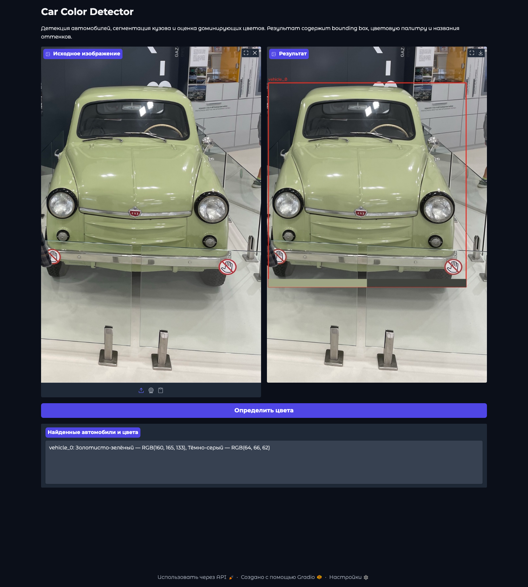
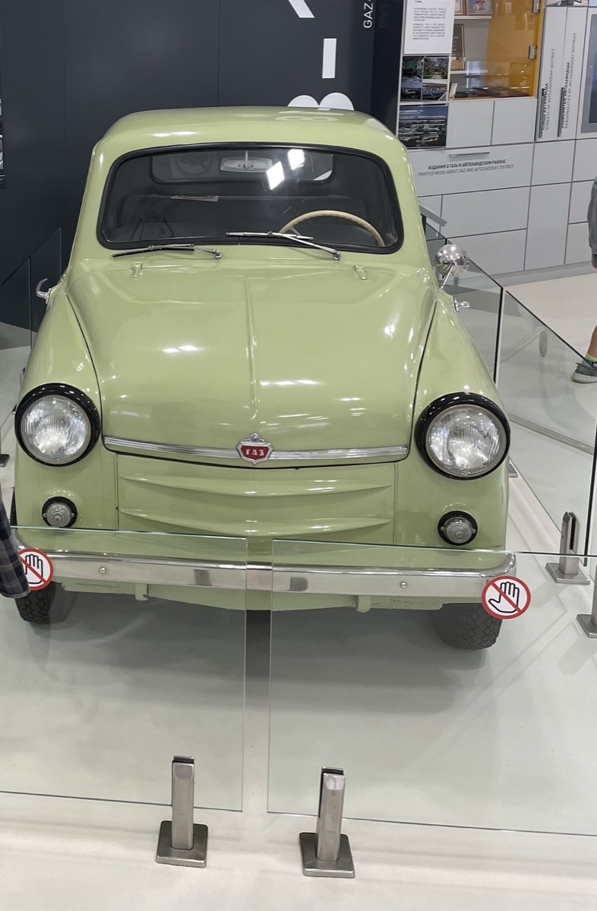
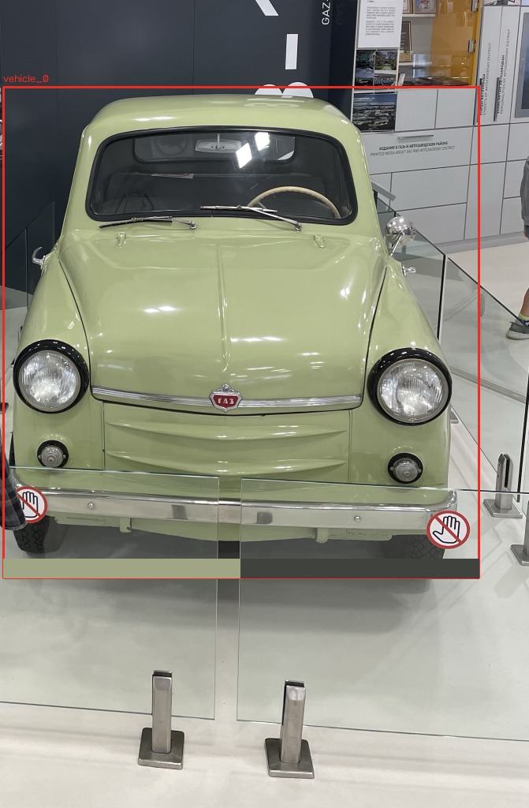
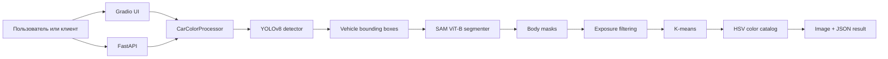

# Car Color Detector

Сервис компьютерного зрения для поиска автомобилей на изображении и определения
доминирующих цветов кузова. Пайплайн объединяет детекцию YOLOv8, сегментацию
Segment Anything и кластеризацию пикселей K-means; результат доступен через
интерактивный Gradio UI и FastAPI.

> Проект является исследовательским прототипом. Он не предназначен для
> идентификации автомобиля, владельца или государственного номера.



_Реальный end-to-end inference на пользовательской фотографии: YOLO нашёл
автомобиль, SAM выделил кузов, а K-means определил
`золотисто-зелёный` и `тёмно-серый` кластеры._

| Входное изображение | Результат пайплайна |
| --- | --- |
|  |  |

## Зачем это нужно

Ручная разметка цвета плохо масштабируется в каталогах транспорта, системах
поиска по фото и аналитических CV-конвейерах. Car Color Detector превращает
изображение в структурированный результат:

```text
изображение → автомобили → маски кузова → RGB-палитра → названия оттенков
```

Потенциальные сценарии применения:

- первичное заполнение атрибута «цвет» в автомобильном маркетплейсе;
- фильтрация и поиск транспорта в медиакаталоге;
- подготовка слабой разметки для последующей ручной верификации;
- исследование устойчивости определения цвета к освещению и фону.

## Возможности

- детекция классов `car`, `truck` и `bus` моделью YOLOv8;
- сегментация каждого bounding box моделью SAM ViT-B;
- fallback на область bounding box при неуверенной сегментации;
- фильтрация слишком тёмных и пересвеченных пикселей;
- извлечение двух доминирующих RGB-кластеров алгоритмом K-means;
- сопоставление с каталогом автомобильных оттенков в HSV-пространстве;
- Gradio-интерфейс для ручной проверки;
- FastAPI с ограничением размера загрузки, readiness endpoint и типизированным
  контрактом ответа;
- CPU-режим по умолчанию и возможность выбрать CUDA через конфигурацию.

## Архитектура



| Слой | Ответственность |
| --- | --- |
| `web.py`, `api.py` | UI, HTTP-контракт, валидация загрузок |
| `pipeline.py` | Оркестрация этапов без зависимости от конкретных моделей |
| `inference.py` | Адаптеры Ultralytics YOLO и Segment Anything |
| `extractor.py` | Фильтрация пикселей и K-means |
| `catalog.py` | Валидация CSV и перевод RGB в название оттенка |
| `factory.py` | Конфигурация и сборка production-зависимостей |

Детектор и сегментатор заданы через `Protocol`. Поэтому orchestration и
HTTP-контракт тестируются без загрузки многогигабайтного ML-окружения и
checkpoint-файлов.

## Технологии

| Контур | Инструменты |
| --- | --- |
| Computer Vision | Ultralytics YOLOv8, Segment Anything, OpenCV |
| Цветовой анализ | NumPy, scikit-learn K-means, HSV distance |
| Delivery | FastAPI, Gradio, Uvicorn |
| Engineering | Python 3.11, `pyproject.toml`, mypy strict, Ruff, pytest |
| Deployment | Docker, Docker Compose, GitHub Actions |

## Быстрый старт

### 1. Установка

```bash
git clone https://github.com/ilyascw/CarColorDetector.git
cd CarColorDetector

python -m venv .venv
source .venv/bin/activate
python -m pip install --upgrade pip
python -m pip install ".[api,web,inference]"
```

Для PyTorch с CUDA рекомендуется сначала выбрать команду установки под свою
версию драйвера на официальном сайте PyTorch.

### 2. Модели

Скачайте `yolov8n.pt` и `sam_vit_b_01ec64.pth` по инструкции
[models/README.md](models/README.md). Веса не хранятся в Git.

```text
models/
├── yolov8n.pt
└── sam_vit_b_01ec64.pth
```

### 3. Gradio UI

```bash
car-color-web
```

Интерфейс будет доступен на `http://localhost:7860`. Модели инициализируются
лениво при первом запросе на обработку.

### 4. FastAPI

```bash
car-color-api
```

Swagger UI: `http://localhost:8000/docs`.

```bash
curl -X POST \
  -F "file=@car.jpg;type=image/jpeg" \
  http://localhost:8000/predict
```

Сокращённый контракт ответа:

```json
{
  "image": "data:image/jpeg;base64,...",
  "cars": {
    "vehicle_0": {
      "bbox": [168, 258, 609, 412],
      "colors_rgb": [[202, 160, 50], [31, 42, 38]],
      "color_names": ["Золотисто-жёлтый", "Тёмно-серый"]
    }
  },
  "description": [
    "vehicle_0: Золотисто-жёлтый — RGB(202, 160, 50), Тёмно-серый — RGB(31, 42, 38)"
  ]
}
```

## Конфигурация

Настройки читаются из переменных окружения. Базовый пример находится в
`.env.example`.

| Переменная | Значение по умолчанию |
| --- | --- |
| `CAR_COLOR_YOLO_MODEL` | `models/yolov8n.pt` |
| `CAR_COLOR_SAM_CHECKPOINT` | `models/sam_vit_b_01ec64.pth` |
| `CAR_COLOR_SAM_MODEL_TYPE` | `vit_b` |
| `CAR_COLOR_DEVICE` | `cpu` |
| `CAR_COLOR_MAX_IMAGE_SIZE` | `1024` |
| `CAR_COLOR_PORT` | `8000` для API, `7860` для UI |

## Docker

Checkpoint-файлы должны находиться в локальной директории `models/`; Compose
подключает её к контейнеру только для чтения.

```bash
docker compose up --build
```

API будет доступен на `http://localhost:8000`. Образ запускается от
непривилегированного пользователя и содержит healthcheck.

## Качество и воспроизводимость

```bash
python -m pip install ".[api,web,dev]"
mypy
ruff check .
pytest
python -m compileall -q src tests
```

CI выполняет те же проверки на каждом push и pull request. Strict mypy
применяется ко всему собственному Python-коду; исключения касаются только
нетипизированных API внешних ML/UI-библиотек.

### Текущий уровень оценки

В репозитории нет размеченного датасета, поэтому проект не заявляет accuracy
определения цвета или качество сегментации. Существующие примеры подтверждают
работоспособность пайплайна, но не являются количественной оценкой.

Для полноценного evaluation нужен набор изображений с разными условиями:

| Этап | Метрика |
| --- | --- |
| Детекция | precision, recall, mAP@50 |
| Сегментация кузова | mask IoU / Dice |
| Цвет | CIEDE2000 и top-1 accuracy по нормализованным классам |
| Система целиком | доля верных `vehicle → color`, p50/p95 latency |

Разбиение следует выполнять по автомобилям или съёмочным сериям, чтобы похожие
кадры одного объекта не попадали одновременно в train/evaluation subsets.

## Ограничения

- цвет зависит от освещения, баланса белого, бликов и качества камеры;
- текущая эвристика не отделяет окрашенный кузов от стёкол, колёс и теней
  идеально;
- каталог содержит коммерческие названия оттенков, но проект не определяет
  заводской код краски;
- при отсутствии корректной SAM-маски используется менее точный bbox fallback;
- checkpoint-файлы загружаются отдельно и требуют значительной памяти;
- коммерческое применение требует отдельно проверить лицензирование
  Ultralytics.

## Структура

```text
src/car_color_detector/
├── api.py          FastAPI delivery layer
├── catalog.py      каталог и HSV matching
├── extractor.py    dominant-color extraction
├── factory.py      runtime configuration
├── inference.py    YOLO и SAM adapters
├── models.py       типизированные domain models
├── pipeline.py     orchestration
└── web.py          Gradio UI
tests/              unit и API tests
notebooks/          исследовательский прототип
assets/             иллюстрации для README
```

## Источники и лицензии компонентов

- [Ultralytics](https://github.com/ultralytics/ultralytics) — YOLO runtime и
  pretrained weights; AGPL-3.0 либо отдельная Enterprise License.
- [Segment Anything](https://github.com/facebookresearch/segment-anything) —
  модель и checkpoint-файлы SAM, Apache-2.0.
- [Исходная статья SAM](https://arxiv.org/abs/2304.02643).

Подробнее: [docs/THIRD_PARTY.md](docs/THIRD_PARTY.md).
